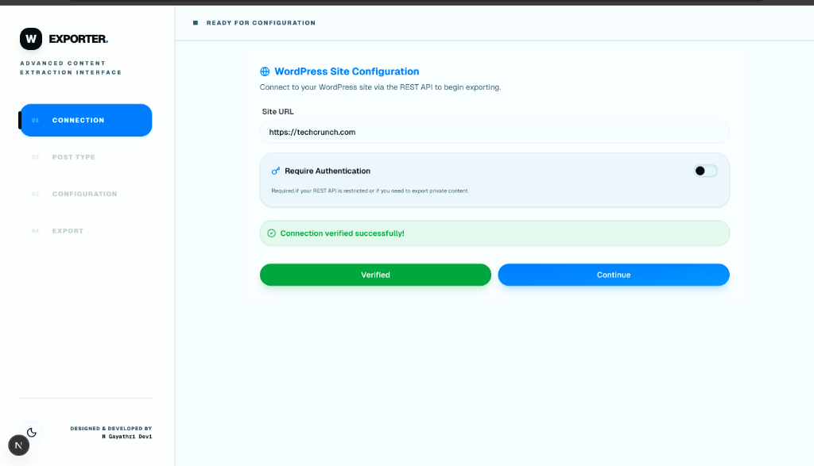
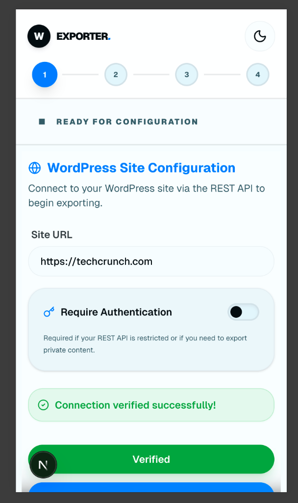

# 🚀 WP Content Exporter

**WP Content Exporter** is a premium, high-performance web interface for extracting and previewing content from WordPress sites via the REST API. Built with a **Balanced Modern** aesthetic, it offers a seamless, app-like experience for developers and content managers.

[](https://wp-content-exporter-web.vercel.app/)
[](https://www.npmjs.com/package/wp-content-exporter)

## ✨ Features

- **Secure Server-Side Proxy**: Connection testing is routed through a Next.js API route (`/api/test-wp`) to bypass browser CORS restrictions and securely handle WordPress authentication.
- **Dynamic Connection**: Effortlessly connect to any WordPress site using Application Password authentication or public access.
- **Smart Configuration**: Filter through complex WordPress data structures with a high-performance, searchable field selector.
- **Live Preview**: Instantly preview field values on hover (desktop) or tap (mobile) before exporting.
- **Balanced Modern UI**: A sleek, glassmorphic design system that features:
  - Full Dark/Light mode support.
  - Micro-animations for feedback (Pulse, Bounce, Slide).
  - A scroll-locked window frame for an "Application" feel.
- **Fully Responsive**: Optimized for every device, featuring a vertical sidebar on desktop and a compact horizontal stepper on mobile.

## 💻 Web & 📱 Mobile Version

The application is a **fully responsive web version** of the WP Content Exporter, which can be used on any browser. It dynamically adapts its layout for a premium experience on both desktop and mobile devices.

### Desktop Experience


### Mobile & Tablet Experience


### 1. Installation
```bash
git clone https://github.com/gayathri1462/wp-content-exporter-web.git
cd wp-content-exporter-web
npm install
```

### 2. Development
```bash
npm run dev
```
Open [http://localhost:3000](http://localhost:3000) to see the result.

### 3. Build & Test
```bash
npm run build
npm run test
```

## 📦 Tech Stack

- **Framework**: [Next.js 15+ (App Router)](https://nextjs.org)
- **Styling**: [Tailwind CSS 4](https://tailwindcss.com)
- **Icons**: [Lucide React](https://lucide.dev)
- **State Management**: React Hooks & Context
- **Testing**: [Vitest](https://vitest.dev) & React Testing Library

## 🚀 Deployment

The easiest way to deploy your **WP Content Exporter** is using the [Vercel Platform](https://vercel.com/new).

### 1. Push to GitHub
Ensure your latest changes are pushed to your GitHub repository:
```bash
git add .
git commit -m "Ready for deployment"
git push origin main
```

### 2. Deploy to Vercel
1. Go to [Vercel](https://vercel.com) and log in.
2. Click **"New Project"**.
3. Import your `wp-content-exporter-web` repository.
4. Vercel will automatically detect **Next.js**.
5. Click **"Deploy"**.

Your site will be live on a `vercel.app` domain in minutes!

---

Designed & Developed by **N Gayathri Devi**
